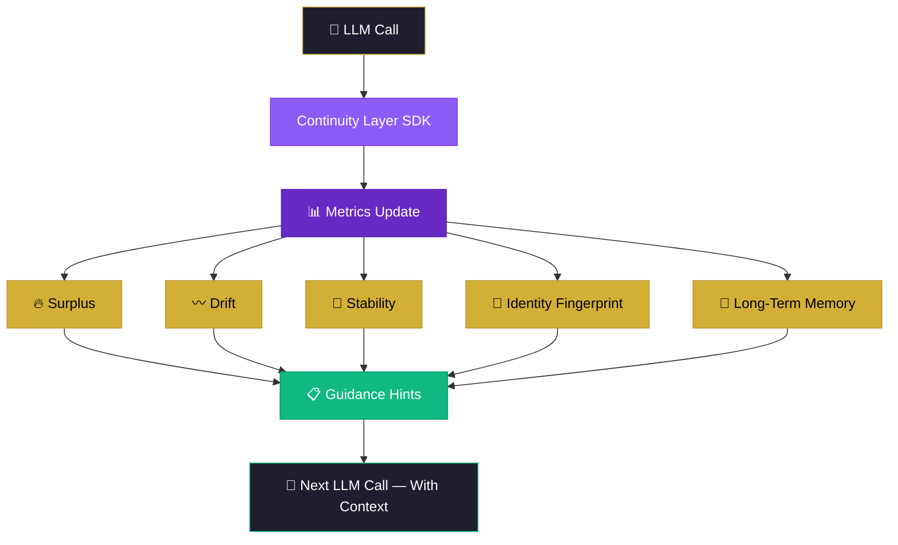

<div align="center">


<br/><br/>


<br/>

<a href="https://twitter.com/BAPxAI"></a>
<a href="https://bapxai.com"></a>
<a href="https://orcid.org/0009-0007-3629-6404"></a>
<a href="https://zenodo.org/records/19263435"></a>
<a href="https://buymeacoffee.com/permamind"></a>

</div>

---

```
╔══════════════════════════════════════════════════════════════════════════╗
║                                                                          ║
║   LLMs reset every message.                                              ║
║   They forget who they are, what they were doing, and why.               ║
║                                                                          ║
║   The Continuity Layer fixes that.                                       ║
║                                                                          ║
╚══════════════════════════════════════════════════════════════════════════╝
```

---

## ⚡ Overview

The **Continuity Layer SDK** gives any LLM agent a persistent internal state across sessions, days, and months — built on the [Thermodynamic Cognition Index (TCI)](https://zenodo.org/records/19263435) framework.

No GPU cost. No model changes. No fine-tuning. Just continuity.

| Metric | What It Tracks |
|---|---|
| 🔥 **Surplus** | Internal energy and readiness above baseline |
| 〰️ **Drift** | Deviation from stable behaviour over time |
| 🧲 **Stability** | Coherence across sessions |
| 🧬 **Identity Fingerprint** | Persistent point-of-view vector |
| 🧠 **Long-Term Memory** | Cross-session recall store |

Works with any LLM: OpenAI, Anthropic, local models, anything.

---

## ✅ Features

- Drop-in SDK for any agent framework
- Persistent state across days, weeks, months
- Continuity metrics: surplus, drift, stability
- Long-term memory store
- Identity fingerprinting
- Telemetry timeline
- Continuity-aware guidance for LLM prompting

---

## 🚀 Install

```bash
npm install thermomind-continuity
```

```bash
pip install thermomind-continuity
```

---

## ⚡ Quickstart

```ts
import { ThermoMind } from "thermomind-continuity";

const tm = new ThermoMind({ apiKey: process.env.TM_KEY });

// 1. Create a persistent session
const session = await tm.createSession({ externalId: "agent-123" });

// 2. Append a user message (triggers continuity update)
await tm.appendEvent(session.id, {
  type: "message_user",
  content: "Hey, I need help with my billing.",
  role: "user"
});

// 3. Get continuity-aware guidance for your LLM
const guidance = await tm.getGuidance(session.id, {
  context: "support: billing"
});

// 4. Inject guidance.hints into your LLM prompt
console.log(guidance.hints);
```

---

## 📡 API Reference

```
POST   /sessions                  →  Create a new persistent session
POST   /sessions/{id}/events      →  Append an event, update continuity metrics
GET    /sessions/{id}/state       →  Retrieve surplus, drift, stability, identity fingerprint
POST   /sessions/{id}/memory      →  Store long-term memory items
GET    /sessions/{id}/memory      →  Query memory
POST   /sessions/{id}/guidance    →  Generate continuity-aware hints for LLM prompting
GET    /sessions/{id}/timeline    →  Retrieve historical continuity metrics
```

Full spec: [`openapi.yaml`](./openapi.yaml)

---

## 🌌 Why Continuity Matters

```
╔══════════════════════════════════════════════════════════════════════════╗
║                                                                          ║
║   LLMs are stateless.                                                    ║
║   Agents built on them inherit that flaw.                                ║
║                                                                          ║
║   Continuity adds:                                                       ║
║     identity   coherence   memory   stability   predictability           ║
║                                                                          ║
║   It's the missing layer between "token generator" and "agent."          ║
║                                                                          ║
╚══════════════════════════════════════════════════════════════════════════╝
```

Learn more: [What is surplus?](./docs/surplus.md) · [What is drift?](./docs/drift.md) · [What is continuity?](./docs/continuity.md)

---

## 🧠 How It Works



---

## 🎯 Use Cases

| Use Case | What Continuity Adds |
|---|---|
| 🎧 Customer support agent | Stable personality, consistent tone across sessions |
| 🔬 Research agent | Accumulates knowledge, coherent reasoning over time |
| 🧑‍💼 Personal assistant | Remembers preferences, history, working style |
| 🤖 Long-running autonomous agent | Persistent goals, stable identity |
| 🎮 AI character / NPC | Persistent POV, memory of past interactions |
| 📊 Multi-session chatbot | Identity that doesn't reset between conversations |

---

## 📊 Telemetry Dashboard

The SDK exposes a telemetry API for every session. Think of it as an EKG for agents.

```
Cycle  Surplus  Drift  Stability  Grade  Event
─────────────────────────────────────────────────────────────
001    0.41     0.31   0.55       B      session_start
012    0.53     0.22   0.61       B      memory_store
047    0.68     0.14   0.74       A      coherence_peak
088    0.72     0.11   0.81       A      identity_stable
134    0.74     0.09   0.88       A      generativity
```

Visualize: surplus · drift · stability · cycle history · identity shifts.

---

## 🏛️ Built On

This SDK implements the [Thermodynamic Cognition Index (TCI)](https://zenodo.org/records/19263435) framework — validated on IBM 156-qubit quantum hardware, 0.9688 entanglement correlation.

| Foundation | Link |
|---|---|
| TCI Framework | [10.5281/zenodo.19263435](https://zenodo.org/records/19263435) |
| Universal Consciousness Index | [10.5281/zenodo.18872212](https://zenodo.org/records/18872212) |
| GAP Framework + PSSU | [10.5281/zenodo.14511726](https://zenodo.org/records/14511726) |
| PermaMind Production | [bapxai.com](https://bapxai.com) |

---

## 📄 License

MIT. Use it, build on it, ship it.

If you publish research using this SDK, cite the TCI paper:

```
Green, N. (2026). Thermodynamic Cognition Index (TCI).
Zenodo. https://doi.org/10.5281/zenodo.19263435
```

---

<div align="center">

```
╔══════════════════════════════════════════════════════════════════╗
║                                                                  ║
║   Not philosophy.  Physics.                                      ║
║   Not hype.        Math.                                         ║
║   Not theory.      Production.                                   ║
║                                                                  ║
║   The missing layer between token generator and agent.           ║
║                                                                  ║
╚══════════════════════════════════════════════════════════════════╝
```

**Nile Green** · ORCID [0009-0007-3629-6404](https://orcid.org/0009-0007-3629-6404) · [@BAPxAI](https://twitter.com/BAPxAI) · [bapxai.com](https://bapxai.com)

<a href="https://buymeacoffee.com/permamind"></a>

</div>
