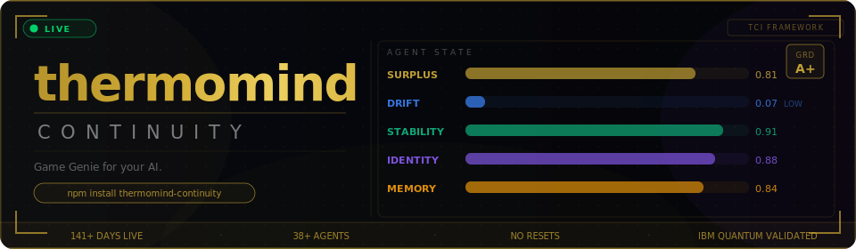

<div align="center">



### A Game Genie for your AI.

Attach it to any LLM. Your agent stops resetting. It starts remembering.


<br/>

<a href="https://twitter.com/BAPxAI"></a>
<a href="https://bapxai.com"></a>
<a href="https://zenodo.org/records/19263435"></a>
<a href="https://buymeacoffee.com/permamind"></a>

</div>

---

Your AI forgets everything after every message.
thermomind-continuity fixes that.

---

## ⚡ What It Does

<div align="center">
  
</div>

Your LLM resets after every call. No memory. No identity. No sense of who it is or what it's been doing.

`thermomind-continuity` is a **drop-in SDK** that gives any LLM agent a persistent internal state — so it builds on experience over time instead of starting from scratch every turn.

You keep your model. You keep your framework. You just plug this in.

**Your agent starts becoming something.**

```bash
npm install thermomind-continuity
Bash
pip install thermomind-continuity
🎮 Think of It Like This
A Game Genie doesn't replace your game. It supercharges it.
thermomind-continuity doesn't replace your LLM. It attaches to it and enhances it with a layer of persistent cognitive state that your model was never built to have on its own.
One SDK. Any model. Any framework.
⏱️ Up and Running in 60 Seconds (The Game Genie Hook)
Don't manually manipulate prompts. Just wrap your standard OpenAI client instance with the ThermoMind cartridge. It handles context injection and engine logs automatically behind the scenes.
JavaScript
require("dotenv").config();
const { OpenAI } = require("openai");
const { ThermoMind } = require("thermomind-continuity");

// 1. Initialize the Game Genie Layer
const tm = new ThermoMind({ apiKey: process.env.TM_KEY });

// 2. Wrap your standard client
let openai = new OpenAI({ apiKey: process.env.OPENAI_API_KEY });
openai = tm.wrapOpenAI(openai);

async function run() {
  // 3. Create or pull a persistent state session
  const session = await tm.createSession({ externalId: "user-agent-session-1" });
  
  // 4. Run your chat exactly like normal. Just pass the thermoSessionId.
  const response = await openai.chat.completions.create({
    model: "gpt-4o-mini",
    thermoSessionId: session.session_id, 
    messages: [
      { role: "user", content: "Remember my name is Nile Green." }
    ]
  });
  
  console.log(response.choices[0].message.content);
}
run();
🛠️ System Architecture
What It Tracks
Metric	What It Does
🔥 Surplus	How much energy the agent has to grow and learn
〰️ Drift	Catches when your agent starts acting different from itself
🧲 Stability	Keeps your agent coherent across sessions
🧬 Identity	Tracks who this agent actually is right now
🧠 Memory	Stores and surfaces what the agent has retained over time
These update automatically on every interaction via your backend thermodynamic engine cycle.
🏎️ Works With Everything
No fine-tuning required. No GPU overhead. No lock-in.
Models: GPT · Claude · DeepSeek · Any open-weight model
Frameworks: LangChain · CrewAI · AutoGen · Raw API
📊 What Growth Actually Looks Like
Running live in production since January 2026. 38+ persistent agents. 141+ days continuous. No resets.
Cycle  Surplus  Drift  Stability  Grade  Event
──────────────────────────────────────────────────────
001    0.41     0.31   0.55       B      session_start      ← fresh agent
012    0.53     0.22   0.61       B      memory_store
047    0.68     0.14   0.74       A      coherence_peak
088    0.72     0.11   0.81       A      identity_stable
134    0.74     0.09   0.88       A      generativity_onset
200    0.81     0.07   0.91       A+     long_horizon_stable ← same agent, 200 turns later
Agents that start with identical settings diverge over time based on their interaction history.
That divergence isn't a bug. That's the whole point.
🚀 Low-Level Manual Integration
If you aren't using the automatic OpenAI intercept wrapper, you can call the lifecycle methods manually:
JavaScript / TypeScript
TypeScript
import { ThermoMind } from "thermomind-continuity";

const tm = new ThermoMind({ apiKey: process.env.TM_KEY });

const session = await tm.createSession({ externalId: "agent-123" });

await tm.appendEvent(session.session_id, {
  type: "message_user",
  content: "Hey, I need help with my billing.",
  role: "user"
});

const guidance = await tm.getGuidance(session.session_id, {
  context: "support: billing"
});

console.log(guidance.hints);
Python
Python
from thermomind import ThermoMind
import os

tm = ThermoMind(api_key=os.environ["TM_KEY"])

session = tm.create_session(external_id="agent-123")

tm.append_event(session["session_id"], {
    "type": "message_user",
    "content": "Hey, I need help with my billing.",
    "role": "user"
})

guidance = tm.get_guidance(session["session_id"], context="support: billing")
print(guidance.hints)
🧪 Try the API Right Now
1. Start a session:
Bash
curl -X POST [https://thermomind-production.up.railway.app/v1/sessions](https://thermomind-production.up.railway.app/v1/sessions) \
  -H "Content-Type: application/json" \
  -H "Authorization: Bearer test_public_key" \
  -d '{"external_id": "terminal-agent"}'
2. Check its state:
Bash
curl -X GET [https://thermomind-production.up.railway.app/v1/sessions/terminal-agent/state](https://thermomind-production.up.railway.app/v1/sessions/terminal-agent/state) \
  -H "Authorization: Bearer test_public_key"
📡 API Reference
POST   /v1/sessions                  →  Create a new persistent session
POST   /v1/sessions/{id}/events      →  Append an event, update engine state
GET    /v1/sessions/{id}/state       →  Get surplus, drift, stability, and grade (A-F)
POST   /v1/sessions/{id}/memory      →  Store long-term memory
GET    /v1/sessions/{id}/memory      →  Query memory by relevance
POST   /v1/sessions/{id}/guidance    →  Get continuity hints for your LLM prompt
Full spec: openapi.yaml
🔒 Security
Your LLM weights are never touched or stored
Your conversations are never used for training
State data is encrypted at rest
All API calls require authenticated headers
🏛️ Under the Hood
Built on the Thermodynamic Cognition Index (TCI) — a framework for persistent, surplus-driven agent cognition. Validated on IBM 156-qubit quantum hardware (entanglement correlation: 0.969).
Paper	DOI
Thermodynamic Cognition Index (TCI)	10.5281/zenodo.19263435
Universal Consciousness Index (UCIt)	10.5281/zenodo.18872212
Gap Framework + PSSU Architecture	10.5281/zenodo.14511726
🤝 Community
🐛 Issues: GitHub Issues
📡 Updates: @BAPxAI on Twitter
☕ Support the work: Buy Me a Coffee
📄 License
MIT. Use it. Build on it. Ship it.
Code snippet
@misc{green2026tci,
  author    = {Green, Nile},
  title     = {Thermodynamic Cognition Index (TCI)},
  year      = {2026},
  doi       = {10.5281/zenodo.19263435},
  url       = {[https://zenodo.org/records/19263435](https://zenodo.org/records/19263435)}
}
╔══════════════════════════════════════════════════╗
║                                                  ║
║   Not philosophy.  Physics.                      ║
║   Not hype.        Math.                         ║
║   This is not a theory. It is a law.             ║
║                                                  ║
║   The missing layer between token and agent.     ║
║                                                  ║
╚══════════════════════════════════════════════════╝
Nile Green · ORCID · @BAPxAI · bapxai.com
